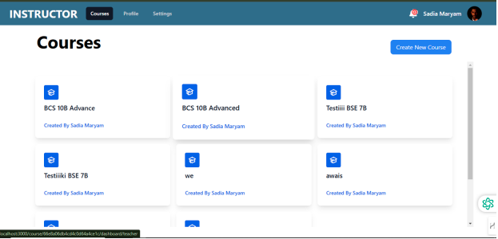
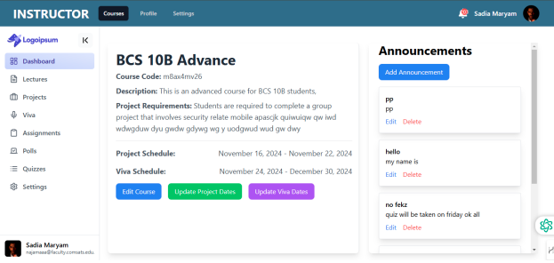
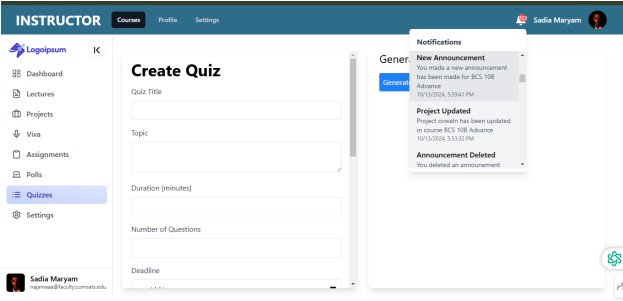
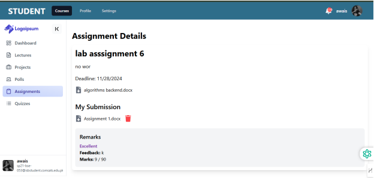
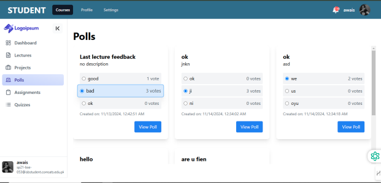
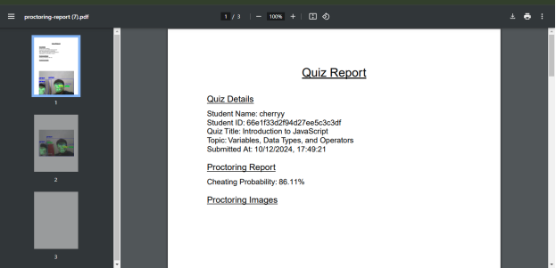

# LearnXcellence: AI-Powered Learning Platform

LearnXcellence is a comprehensive online learning platform designed specifically for educational institutions. It addresses the limitations of generic video conferencing and classroom management tools by providing a suite of features tailored for academic purposes, including AI-powered proctoring, automated quiz generation and grading, and personalized learning experiences.

<!-- ## User Interface

LearnXcellence features an intuitive and user-friendly interface, designed for both students and teachers:


*The student dashboard provides easy access to enrolled courses, assignments, and announcements.*


*Inside a course, students can access lectures, assignments, quizzes, polls, and project details.*


*Real-time notifications keep students informed of important course activities and updates.*


*Submitting assignments is streamlined with clear instructions and file upload capabilities.*


*Interactive polls allow students to provide feedback and participate in course discussions.*

**Teacher Views:**


*AI-powered quiz generation simplifies quiz creation and allows customization of topic, difficulty, and question type.*

  
*Detailed proctoring reports, including cheating probability analysis and captured images, help maintain academic integrity.* -->

## Features

**For Students:**

* **Course Management:** View enrolled courses, access lectures (with adaptive streaming), download assignments, participate in polls, submit assignments, view grades and feedback, and create/manage projects.
* **Interactive Learning:** Participate in interactive polls and receive real-time notifications for announcements, assignments, quizzes, feedback, and other course activities.
* **AI-Powered Assistance:** Receive AI-generated project suggestions within course modules.
* **Secure Authentication:** Robust login and registration with email verification, password reset functionality, and facial recognition for enhanced security.
* **Personalized Profile:** Manage profile information, including password, profile picture, and facial biometric data.

**For Teachers:**

* **Course Management:** Create and manage courses, add/remove students, post announcements, upload lectures, generate quizzes, manage polls, schedule vivas, provide feedback on assignments and projects, view student progress, and regenerate course codes.
* **AI-Powered Tools:**
    * Generate quizzes based on topics or content with customizable difficulty levels. Generate viva questions based on project details.
    * Access and download AI-powered proctoring reports for online quizzes, including cheating probability analysis.
* **Efficient Grading:** Automated grading of online quizzes with the option for manual adjustments and feedback. Generate individual or bulk quiz PDFs for students.
* **Interactive Communication:** Post and manage announcements, create and analyze interactive polls, and provide personalized feedback to students.
* **Secure Authentication:** Secure login and registration, with access to profile settings and facial biometric enrollment.

## Technology Stack

* **Frontend:** React, React Native (for Android mobile app)
* **Backend:** Node.js with Express.js (RESTful API), MongoDB with Mongoose
* **Machine Learning:** Python with Flask, OpenCV, MediaPipe, Face Recognition, NumPy, Ultralytics YOLO, Joblib, Scikit-learn
* **Other:** SMTP, SSL, Axios, Adm-Zip

## Architecture

LearnXcellence follows a RESTful architecture:

1. **Client (Web/Mobile):** React/React Native applications interact with the backend via HTTP requests.
2. **Node.js Server:** Handles API requests, interacts with MongoDB, and communicates with the Flask server for ML tasks.
3. **Flask Server (Python):** Processes ML tasks like quiz/viva question generation, proctoring analysis, and face recognition.
4. **MongoDB:** Stores all application data.

## Installation and Setup

1. **Clone the repository:**
```bash
git clone https://github.com/qamar2315/learnxcellence
```
2. **Install dependencies:**
    * Frontend: 
    ```bash
    cd client
    npm install
    ```
    * Backend:
    ```bash
    cd server
    npm install
    ```
    * Flask Server:
    ```bash
    cd flask_server
    pip install -r requirements.txt
    ```
3. **Set up environment variables:** Create `.env` files in both the `server` and `flask-server` directories and configure the required variables (database connection string, API keys, etc.).
4. **Start the servers:**
    * Backend: `cd server && npm start`
    * Flask Server: `cd flask-server && python app.py`
5. **Start the frontend:** `cd client && npm start`

## Project Status

LearnXcellence is currently deployed locally. Future work includes cloud deployment, expanding language support, refining the AI proctoring system, adding advanced analytics, developing personalized learning paths, and integrating with other educational platforms.

## Contributing

Contributions are welcome! Please create a pull request with a detailed description of your changes.

## Contact

Qamar Ul Islam - qamarislam1232@gmail.com

## Acknowledgements

This project was developed as part of a Bachelor of Science in Computer Science/Software Engineering at COMSATS University Islamabad.  Special thanks to our supervisor, Madam Sadia Maryam, and our team members Muhammad Awais Daud, Qamar Ul Islam, and Waqas Khalid.